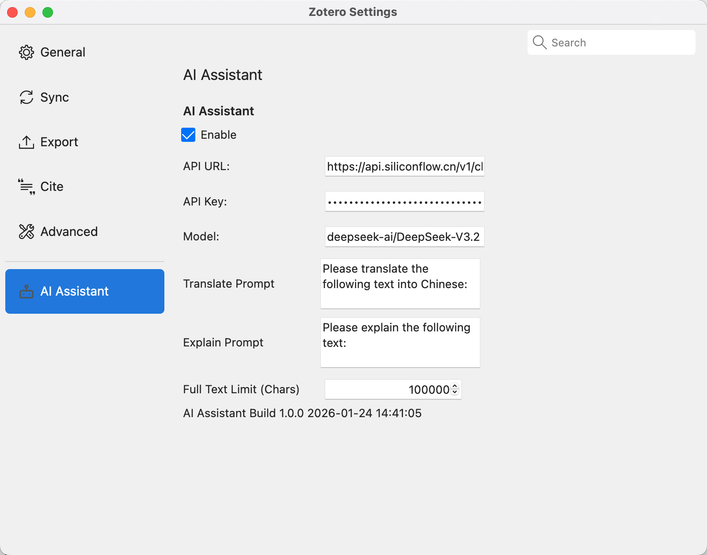
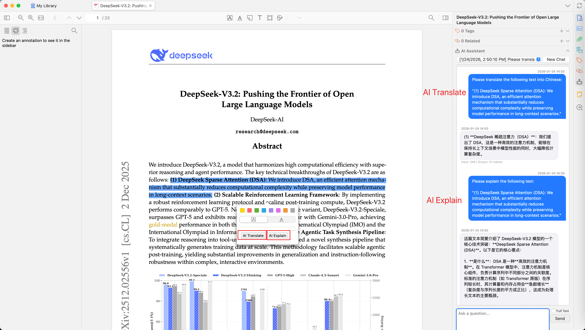
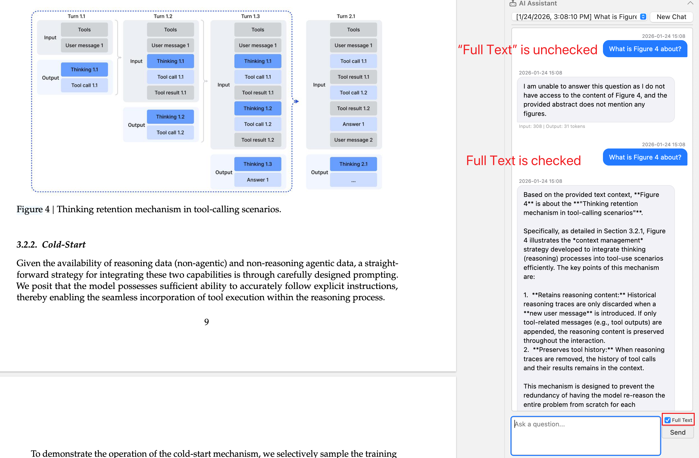

  # Zotero AI Assistant

[](https://www.zotero.org)
[](https://github.com/windingwind/zotero-plugin-template)
[](https://www.gnu.org/licenses/agpl-3.0)

**English** | [简体中文](doc/README-zhCN.md)

Zotero AI Assistant is an intelligent AI assistant plugin designed for [Zotero 7](https://www.zotero.org/), helping you read and understand academic literature more efficiently.

**The plugin requires the use of an API to interact with the AI model. You need to get an API key from a LLM provider like OpenAI, Grok, DeepSeek, etc.**

## ✨ Features

### 🤖 Intelligent Chat

- **Sidebar Chat Panel**: Integrated AI chat interface in Zotero item details pane
- **Context Awareness**: AI automatically retrieves the current item's title and abstract as conversation context
- **Full-Text Analysis**: Enable the "Full Text" option to send PDF full-text content to AI for in-depth analysis
- **Selected Text Q&A**: Automatically detects selected text in PDF reader and uses it as conversation context
- **Streaming Response**: Supports SSE streaming, displaying AI responses in real-time
- **Token Statistics**: Shows input/output token consumption for each conversation

### 💬 Session Management

- **Multi-Session Support**: Create multiple independent chat sessions for each item
- **Persistent Storage**: Chat history automatically saved as JSON file attachments, linked to items
- **Session Switching**: Quickly switch between historical sessions via dropdown
- **New Session**: Create a new chat session with one click

### 📖 PDF Reader Integration

- **Text Selection Popup**: Quick action buttons appear when selecting text in PDF reader
- **AI Translate**: Send selected text to AI for translation with one click
- **AI Explain**: Let AI explain selected technical terms or complex sentences with one click

### ⚙️ Flexible Configuration

- **Multi-Model Support**: Compatible with various LLMs that support OpenAI API format
  - OpenAI (GPT-5, etc.)
  - Claude (via compatible API)
  - Chinese models (DeepSeek, Qwen, Zhipu AI, etc.)
  - Local models (Ollama, LM Studio, etc.)
- **Custom Prompts**: Customize prompt templates for translation and explanation features
- **Full-Text Length Limit**: Set the maximum character count sent to AI

## 📸 Screenshots

### Settings Interface

Configure API and prompts in Zotero settings:



### Selected Text Q&A

Quickly translate or explain selected text in the PDF reader:



### Full-Text Analysis

Check the "Full Text" option to send the entire PDF content to AI for analysis:



### Session History

Switch between different historical sessions using the dropdown:


### AI Chat Saved as Attachment

Chat history is saved as a JSON file attachment, which can be opened and viewed locally:


## 📦 Installation

### Download from Release

1. Go to the [Releases](https://github.com/jetxa/zotero-ai-assistant/releases) page
2. Download the latest `.xpi` file
3. In Zotero, open `Tools` → `Add-ons`
4. Click the gear icon and select `Install Add-on From File...`
5. Select the downloaded `.xpi` file to install

### Build from Source

```bash
# Clone the repository
git clone https://github.com/jetxa/zotero-ai-assistant.git
cd zotero-ai-assistant

# Install dependencies
npm install

# Build the plugin
npm run build
```

After building, find the `.xpi` file in the `.scaffold/build/` directory.

## ⚙️ Configuration

After installation, open `Edit` → `Settings` → `AI Assistant` in Zotero to configure:

| Setting | Description | Example |
|---------|-------------|---------|
| **API URL** | AI service API endpoint | `https://api.openai.com/v1/chat/completions` |
| **API Key** | API key | `sk-xxxx...` |
| **Model** | Model name | `gpt-5`, `deepseek-chat` |
| **Translate Prompt** | Translation prompt template | `Please translate the following text into Chinese:` |
| **Explain Prompt** | Explanation prompt template | `Please explain the following text:` |
| **Full Text Limit** | Maximum characters for full text | `100000` |

### Common API Configuration Examples

<details>
<summary><b>OpenAI</b></summary>

```
API URL: https://api.openai.com/v1/chat/completions
Model: gpt-5
```

</details>

## 🚀 Usage

### Sidebar Chat

1. Select an item in Zotero
2. Find the **AI Assistant** section (robot icon) in the right details panel
3. Enter your question in the input box and click **Send**
4. To analyze full text, check the **Full Text** option. This extracts the PDF full-text content and sends it to AI as context. **Note: This consumes more tokens (you can configure the maximum character count in settings)**

### PDF Quick Translate/Explain

1. Open a PDF attachment
2. Select the text you want to translate or explain
3. Click **AI Translate** or **AI Explain** in the popup toolbar
4. Switch to the sidebar to view the AI response

## 📁 Data Storage

Chat history is saved as JSON file attachments linked to items:

- Filename format: `AI-Assistant-YYYYmmDDHHMMSS.json`
- Automatically linked to the corresponding item
- Can be viewed and managed directly in Zotero

## 🛠️ Development

This project is built on [zotero-plugin-template](https://github.com/windingwind/zotero-plugin-template) and was entirely developed using [gemini-cli](https://github.com/google-gemini/gemini-cli).

Issues and Pull Requests are welcome!

## 📄 License

This project is licensed under [AGPL-3.0](LICENSE).

## 🙏 Acknowledgments

- [zotero-plugin-template](https://github.com/windingwind/zotero-plugin-template) - Plugin development template
- [zotero-plugin-toolkit](https://github.com/windingwind/zotero-plugin-toolkit) - Plugin development toolkit

---

**If this project helps you, please give it a ⭐ Star!**
