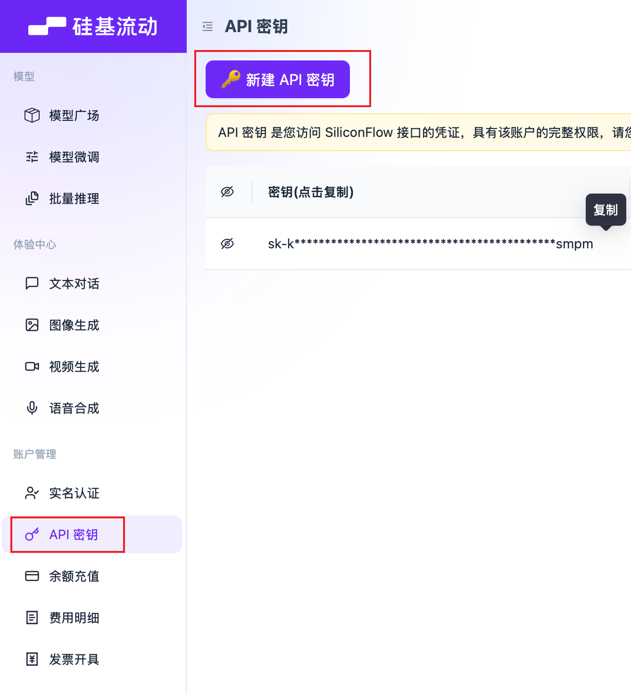
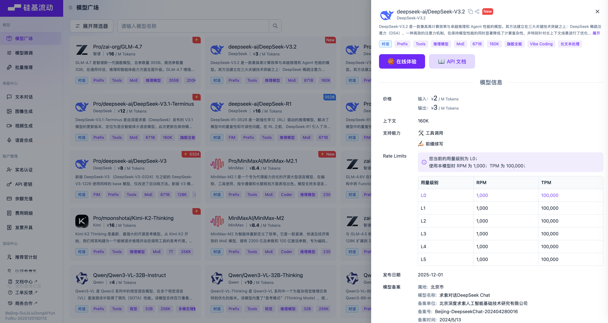

# 如何获取API

目前各大模型厂商都有提供API接口，以下列举一些常用的模型API获取方式。

大部分API都需要进行实名认证并充值（充值10元就可以用很久），免费的模型一般是小参数量模型，效果可自行评估。

## 模型用量及价格计算
- 价格用量计算
    - API以模型的输入及生成的token来计费，一般情况下模型中 token 和字数的换算比例大致如下：
        - 1 个英文字符 ≈ 0.3 个 token
        - 1 个中文字符 ≈ 0.6 个 token

- 模型的价格，以DeepSeek为例：
    - DeepSeek-V3.2: 
        - 输入（命中缓存）：每百万token花费0.2元
        - 输入（未命中缓存）：每百万token花费2元
        - 输出：每百万token花费3元

- 一篇论文大概要花多少钱？
    - 以DeepSeek-V3.2论文为例（pdf文章共23页，网页地址[https://arxiv.org/html/2512.02556v1](https://arxiv.org/html/2512.02556v1))，
        - 论文字符数：读取网页版论文，共5.7万个字符，按照换算关系，约1.7w个token。
        - 耗费token数量估算：
            - 输入：全文约1.7w个token，价格：1.7w * 2 / 100w = 0.034元
            - 输出：假定读一片论文总共生成3000字的回答，约0.2w token，价格：0.2w * 3 / 100w = 0.006元
        - 总计：0.04元，充值10元可以读250篇论文。

- 不同模型价格不同，以实际调用为准。

## 各大模型厂商API获取方式

### 硅基流动

#### 注册

- [https://www.siliconflow.cn](https://www.siliconflow.cn)
- [https://cloud.siliconflow.cn/i/FNysSLW3](https://cloud.siliconflow.cn/i/FNysSLW3) , 该链接含有我的个人邀请码，通过该链接注册会给我发放代金券，介意者使用上一个无邀请码版本即可

- 注册登录后，点击左侧的“API密钥”即可生成API Key

#### API配置

- API URL: https://api.siliconflow.cn/v1/chat/completions
- API Key: sk-xxxx
- Model: 可以在模型广场选择不同的模型，如
    - Qwen/Qwen3-8B（免费）
    - Pro/zai-org/GLM-4.7
    - deepseek-ai/DeepSeek-V3.2

不同模型的效果、价格、响应时间都不一样，可以根据自己的需求选择

#### 充值
找到“余额充值”，充值后即可调用，也可以选择免费模型进行验证，效果自行评估。

- 免费模型：Qwen/Qwen3-8B

### DeepSeek

#### 注册

- [https://www.deepseek.com/](https://www.deepseek.com/) , 选择“API开放平台”，进行注册

#### 生成API Key
创建API Key，并进行充值

- [https://platform.deepseek.com/](https://platform.deepseek.com/)

#### API配置
- API URL: https://api.deepseek.com/v1/chat/completions
- API Key: sk-xxxx
- Model: deepseek-chat

### 其他大模型及API平台

| 平台 | API 获取地址 |
|------|-------------|
| 阿里云 | https://www.alibabacloud.com/help/zh/model-studio/get-api-key |
| 智谱 AI | https://open.bigmodel.cn |
| Kimi | https://platform.moonshot.cn/ |
| 火山引擎 | https://www.volcengine.com/docs/82379/1494384?lang=zh |
