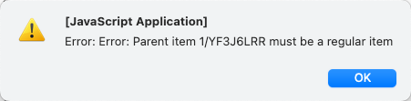
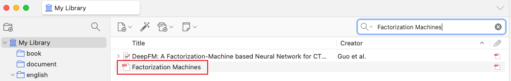
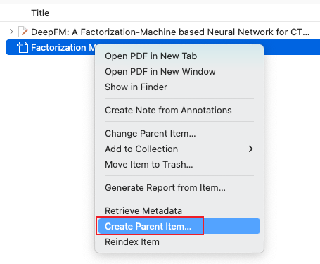
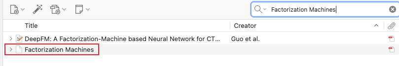

## 常见问题

### 1. 发送消息提示 Parent Item xxxxxxxx must be a regular item

**问题示意图**

**解决方法**

1. 检查当前文献是否为单个文件，而不是zotero Item
   如下图

- DeepFM: A Factorization-Machine based Neural Network for C..., 这篇文献前面有一个 `>` 符号，表示是zotero Item
- Factorization Machines, 这篇文献前面没有 `>` 符号，表示是单个文件

2. 将单个文件转换为zotero Item：选中文件，右键点击，选择 `Create Parent Item`

3. 转换后，文献变为zotero Item，前面有一个 `>` 符号，表示是zotero Item

