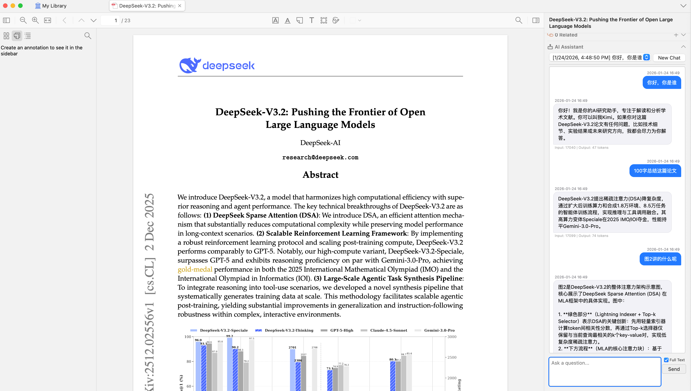
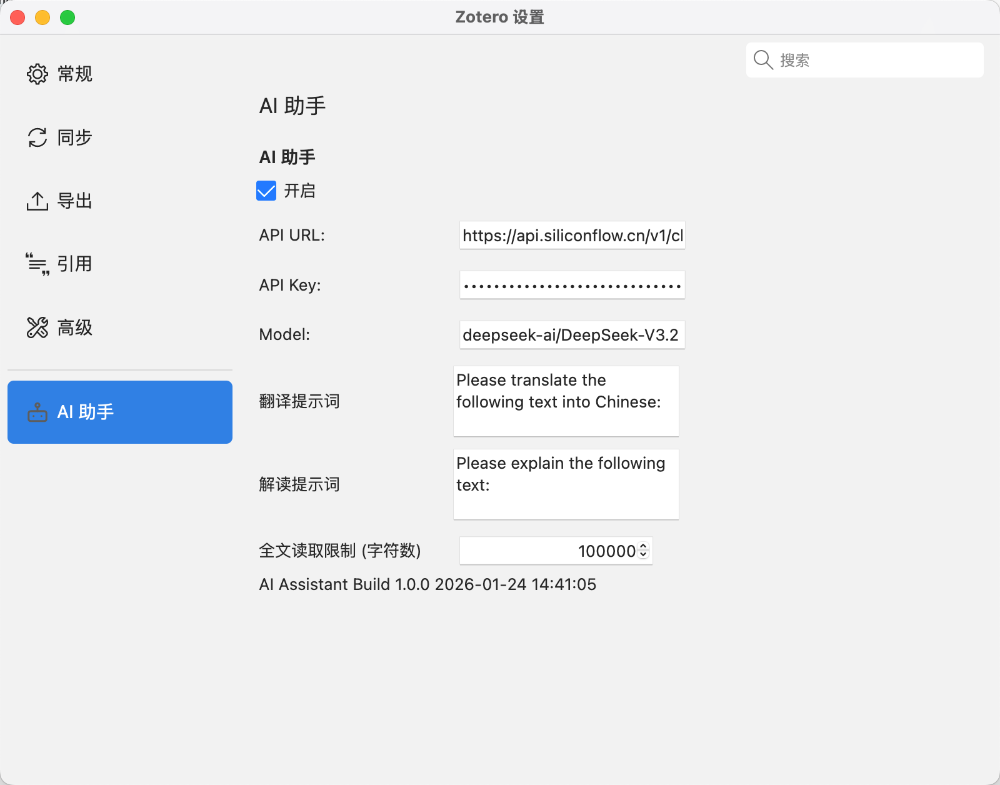
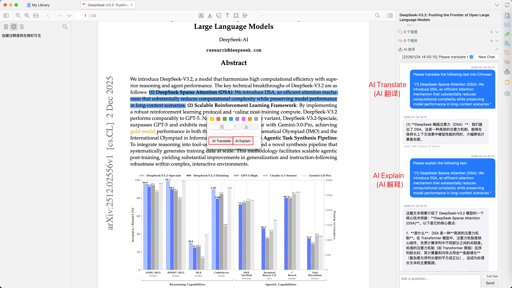
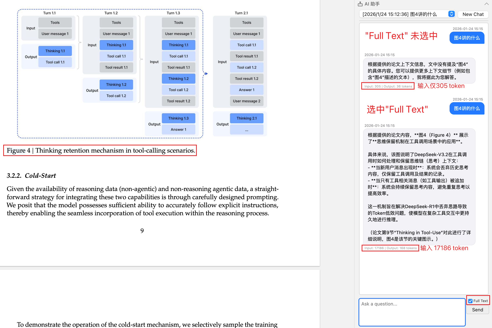
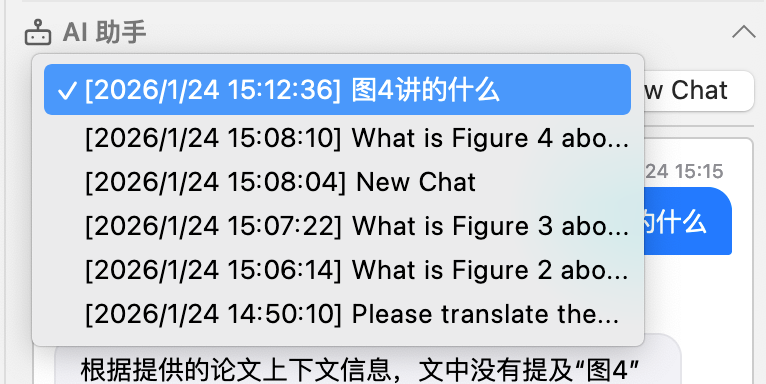
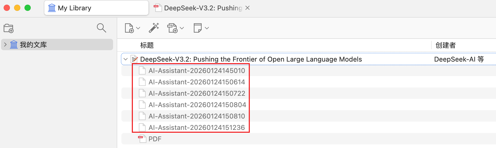
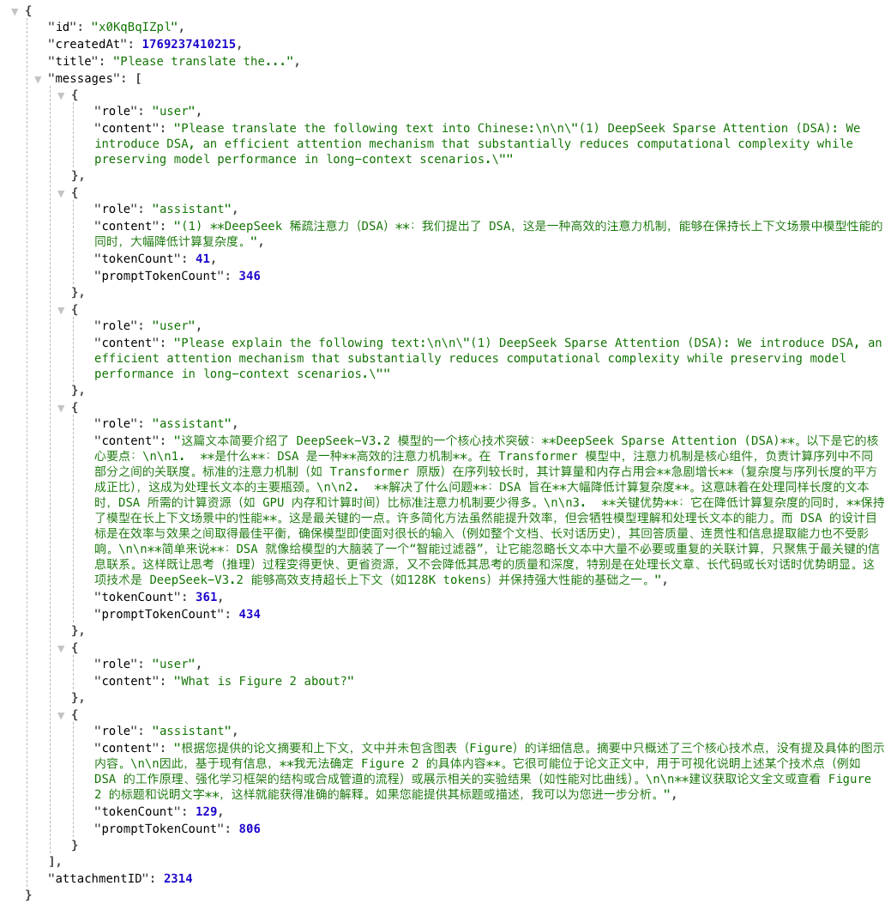

# Zotero AI Assistant

[](https://www.zotero.org)
[](https://github.com/windingwind/zotero-plugin-template)
[](https://www.gnu.org/licenses/agpl-3.0)

[English](../README.md) | **简体中文**

Zotero AI Assistant 是一个为 [Zotero 7](https://www.zotero.org/) 设计的智能 AI 助手插件，可以帮助您更高效地阅读和理解学术文献。

**插件需要使用大模型API，通过API与大模型进行交互，[点我了解如何获取API](API.md)**



## ✨ 功能特性

### 🤖 智能对话

- **侧边栏聊天面板**：在 Zotero 条目详情页中集成 AI 对话界面
- **上下文感知**：AI 自动获取当前文献的标题和摘要作为对话上下文
- **全文分析**：支持勾选 "Full Text" 选项，将 PDF 全文内容发送给 AI 进行深度分析
- **选中文本问答**：自动识别 PDF 阅读器中选中的文本，并将其作为对话上下文
- **流式响应**：支持 SSE 流式传输，实时显示 AI 回复内容
- **Token 统计**：显示每次对话的输入/输出 Token 消耗

### 💬 会话管理

- **多会话支持**：每个文献条目可创建多个独立对话会话
- **持久化存储**：对话历史自动保存为 JSON 文件附件，与文献关联
- **会话切换**：通过下拉框快速切换历史会话
- **新建会话**：一键创建新的对话会话

### 📖 PDF 阅读器集成

- **文本选择弹窗**：在 PDF 阅读器中选中文本时，自动弹出快捷操作按钮
- **AI 翻译**：一键将选中文本发送给 AI 进行翻译
- **AI 解释**：一键让 AI 解释选中的专业术语或复杂句子

### ⚙️ 灵活配置

- **多模型支持**：兼容 OpenAI API 格式的各类大语言模型
  - OpenAI (GPT-5 等)
  - Claude (通过兼容 API)
  - 国产模型（DeepSeek、通义千问、智谱 AI 等）
  - 本地模型（Ollama、LM Studio 等）
- **自定义提示词**：可自定义翻译和解释功能的提示词模板
- **全文长度限制**：可设置发送给 AI 的全文最大字符数

## 📸 功能示意

### 设置界面

在 Zotero 设置中配置 API 和提示词：



### 选中文本问答

在 PDF 阅读器中选中文本后，可以快速使用 AI 翻译或解释功能：



### 全文分析

勾选 "Full Text" 选项后，插件会自动提取 PDF 全文内容作为上下文发送给 AI, **会消耗较多 token（可在设置中配置全文最大字符数）**：



### 历史会话选择

下拉框选择不同的历史会话



### 与AI会话本地保存为附件



### AI会话内容可本地打开查看



## 📦 安装

### 从 Release 下载

1. 前往 [Releases](https://github.com/jetxa/zotero-ai-assistant/releases) 页面
2. 下载最新版本的 `.xpi` 文件
3. 在 Zotero 中，打开 `工具` → `附加组件`
4. 点击齿轮图标，选择 `Install Add-on From File...`
5. 选择下载的 `.xpi` 文件进行安装

### 或从源码构建安装

```bash
# 克隆仓库
git clone https://github.com/jetxa/zotero-ai-assistant.git
cd zotero-ai-assistant

# 安装依赖
npm install

# 构建插件
npm run build
```

构建完成后，在 `.scaffold/build/` 目录下找到 `.xpi` 文件。

## ⚙️ 配置

安装插件后，在 Zotero 中打开 `编辑` → `设置` → `AI 助手` 进行配置：

| 配置项 | 说明 | 示例 |
|--------|------|------|
| **API URL** | AI 服务的 API 端点 | `https://api.siliconflow.cn/v1/chat/completions` |
| **API Key** | API 密钥 | `sk-xxxx...` |
| **Model** | 模型名称 | `deepseek-ai/DeepSeek-V3.2`, `Pro/zai-org/GLM-4.7` |
| **Translate Prompt** | 翻译提示词模板 | `请将以下文本翻译成中文：` |
| **Explain Prompt** | 解释提示词模板 | `请解释以下文本：` |
| **Full Text Limit** | 全文最大字符数，避免文章过长时消耗过多token，可自行调节 | `100000` |

### 常用 API 配置示例

<details>
<summary><b>硅基流动</b></summary>

```
API URL: https://api.siliconflow.cn/v1/chat/completions
Model: Pro/zai-org/GLM-4.7
```

</details>

<details>
<summary><b>DeepSeek</b></summary>

```
API URL: https://api.deepseek.com/v1/chat/completions
Model: deepseek-chat
```

</details>

## 🚀 使用方法

### 侧边栏对话

1. 在 Zotero 中选择一个文献条目
2. 在右侧详情面板中找到 **AI 助手** 区域（机器人图标）
3. 在输入框中输入问题并点击 **Send** 按钮
4. 如需分析全文，勾选 **Full Text** 选项，该选项会提取 PDF 的全文内容发送给 AI 作为上下文，**会消耗较多 token（可在设置中配置全文最大字符数）**

### PDF 快捷翻译/解释

1. 打开文献的 PDF 附件
2. 选中需要翻译或解释的文本
3. 在弹出的工具栏中点击 **AI Translate** 或 **AI Explain**
4. 切换到侧边栏查看 AI 回复

## 📁 数据存储

对话历史以 JSON 文件形式保存为文献条目的附件：

- 文件名格式：`AI-Assistant-YYYYmmDDHHMMSS.json`
- 自动与对应文献条目关联
- 可在 Zotero 中直接查看和管理

## 🛠️ 开发说明

本插件基于 [zotero-plugin-template](https://github.com/windingwind/zotero-plugin-template) ，全部由[gemini-cli](https://github.com/google-gemini/gemini-cli)完成开发。

欢迎提交Issues 和 Pull Requests!

## 📄 许可证

本项目采用 [AGPL-3.0](LICENSE) 许可证。


## 🙏 致谢

- [zotero-plugin-template](https://github.com/windingwind/zotero-plugin-template) - 插件开发模板
- [zotero-plugin-toolkit](https://github.com/windingwind/zotero-plugin-toolkit) - 插件开发工具包

---

**如果这个项目对您有帮助，请给个 ⭐ Star 支持一下！**
